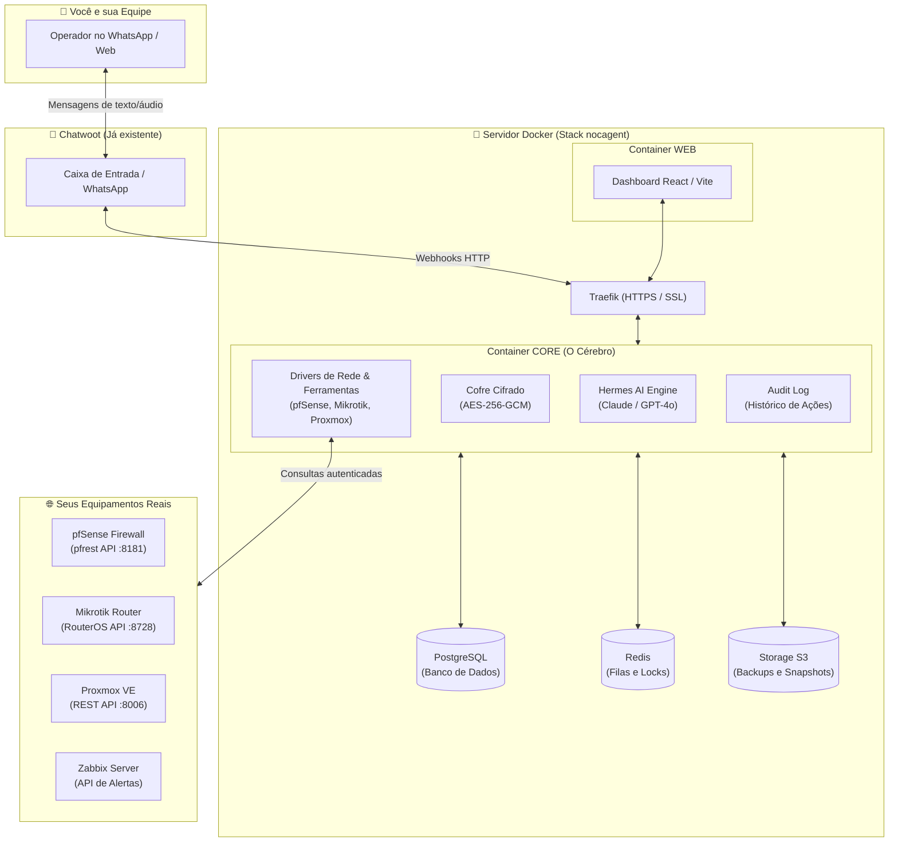
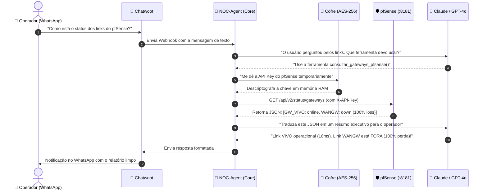
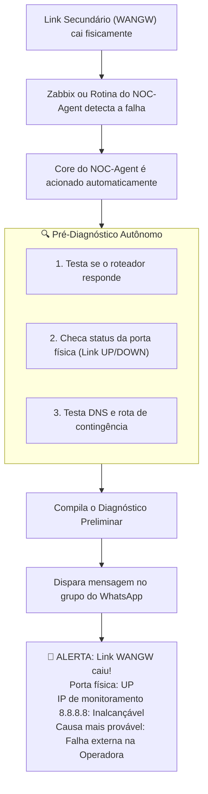
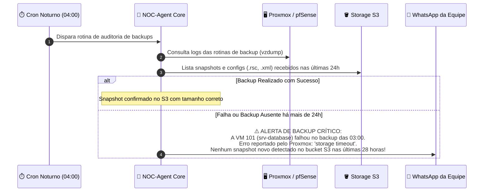
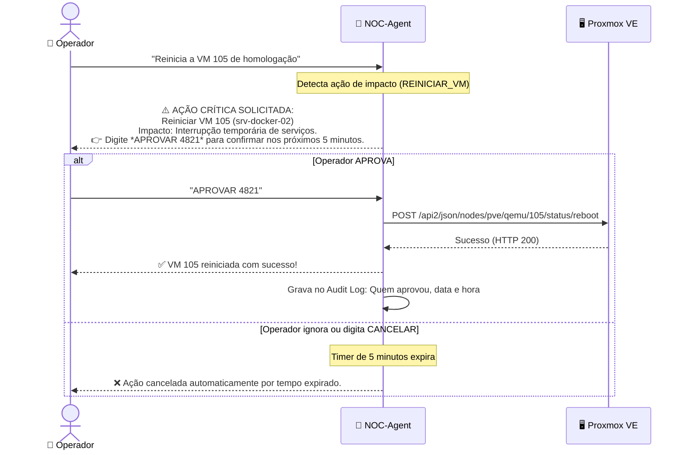
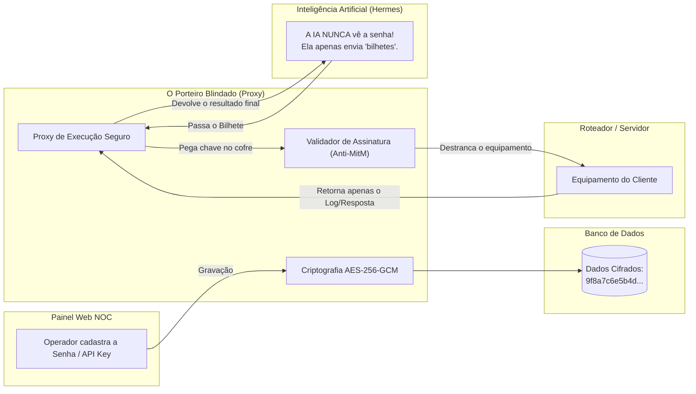

# 📘 Manual Ilustrado do NOC-Agent: Como Funciona na Prática

> **Público-alvo:** Qualquer pessoa técnica ou em transição que queira entender exatamente **o que** o NOC-Agent faz e **COMO** ele faz nos bastidores — sem jargões desnecessários e com diagramas visuais passo a passo.

---

## 📌 O que significa NOC?

**NOC** é a sigla para **Network Operations Center** (em português, *Centro de Operações de Rede*).

No mundo de provedores de internet (ISPs), data centers e empresas de tecnologia, o NOC é a "torre de controle" responsável por **monitorar 24 horas por dia, 7 dias por semana**, toda a infraestrutura:
- Se os links de internet das operadoras estão funcionando ou caíram;
- Se os roteadores de borda e switches estão sobrecarregados;
- Se os servidores e máquinas virtuais estão saudáveis;
- Se os backups diários foram concluídos com sucesso.

O objetivo principal de um time de NOC é **descobrir e corrigir problemas antes que os clientes ou usuários percebam**. 

O **NOC-Agent** é o seu especialista de NOC virtual impulsionado por Inteligência Artificial: ele executa essas checagens, investiga causas de quedas, audita backups e responde chamados da sua equipe em segundos no WhatsApp.

---

## 🧭 1. A Grande Ideia: O que é o NOC-Agent?

Pense no **NOC-Agent** como um **Engenheiro de Redes & Infraestrutura 24/7** que:
1. **Fica de plantão** no seu WhatsApp (via Chatwoot).
2. **Tem as chaves do cofre** para consultar seus roteadores, firewalls e servidores.
3. **Audita backups e saúde de links** de forma proativa, alertando sobre falhas no storage S3.
4. **Nunca toma decisões perigosas sozinho** sem pedir sua permissão expressa.
5. **Responde em segundos** com diagnósticos completos, gráficos e sugestões de correção.

---

## 🏗️ 2. O Mapa da Cidade: Onde cada peça fica instalada?

Você não precisa de 10 servidores diferentes. Toda a inteligência roda em cima da sua infraestrutura Docker que você já tem:

---

## 🔍 3. COMO Funciona: Cenários Reais do Dia a Dia

Para entender como tudo funciona, vamos acompanhar 4 situações práticas do cotidiano de uma operação de rede:

---

### 🔹 Cenário 1: Uma Pergunta Comum no WhatsApp
> **Operador pergunta:** *"Como está o status dos links do pfSense agora?"*

Aqui está o que acontece em menos de 2 segundos:

#### ❓ O que você precisou fazer?
Apenas mandar uma mensagem normal no WhatsApp. O robô entendeu a intenção, chamou a API certa, traduziu a resposta técnica e respondeu.

---

### 🔹 Cenário 2: Alerta Automático de Queda (Modo Proativo)
> O que acontece quando um link cai às 03:00 da manhã sem ninguém perguntar nada?

#### 💡 A diferença:
Em vez de acordar com o cliente reclamando que a internet está lenta, você acorda com uma notificação do agente dizendo **o que caiu**, **quando caiu** e **qual é a causa provável**.

---

### 🔹 Cenário 3: Análise e Alertas Proativos de Backups
> O que acontece se a rotina de backup de uma máquina virtual ou roteador falhar de madrugada?

Backup esquecido é o maior risco silencioso de qualquer operação de TI. O NOC-Agent audita ativamente a integridade dos seus backups:

#### 💡 O que o NOC-Agent analisa nos backups:
1. **Status de Execução:** Se as rotinas agendadas no Proxmox, Mikrotik ou pfSense completaram com código de sucesso (`OK`) ou erro.
2. **Presença no Storage S3:** Confirma se o arquivo de snapshot ou configuração realmente chegou ao bucket S3 e se possui tamanho compatível (evitando backups corrompidos de 0 bytes).
3. **Tempo de Defasagem (SLA de Backup):** Alerta se algum equipamento ou VM estiver sem backup novo há mais de 24 ou 48 horas.
4. **Consulta sob Demanda:** A qualquer momento, pergunte no WhatsApp: *"Como estão os backups de hoje?"* e receba uma tabela limpa com status de cada host.

---

### 🔹 Cenário 4: Ação Crítica com "Human-in-the-Loop" (Aprovação)
> **Operador manda:** *"Reinicia a VM 105 no Proxmox"* ou *"Derruba a rota estática X"*

O NOC-Agent **JAMAIS** executa comandos destrutivos ou de impacto sem confirmação. Veja como é a trava de segurança:

---

### 🔹 Cenário 5: Segurança Absoluta (A Analogia do "Porteiro Blindado")

Muitas empresas têm receio justificado de colocar senhas de roteadores e servidores na mão de uma Inteligência Artificial. Aqui está **exatamente como nossa arquitetura resolve isso usando o conceito de Proxy de Execução Zero-Trust (Conhecimento Zero)**.

Para entender fácil, pense na seguinte analogia:

Imagine que a IA é um funcionário que precisa checar um servidor. 
- **No modelo antigo (Inseguro):** Você entrega a chave-mestra (senha) na mão do funcionário. Ele vai até a sala, destranca e faz o que precisa. O risco? Ele está andando com a chave no bolso. Pode anotar num papel (vazar a senha no chat) ou ser enganado e entregar a chave para a pessoa errada.
- **No nosso modelo (O Porteiro Blindado):** A IA nunca recebe a chave! Quando ela precisa checar o servidor, ela escreve um bilhete para o nosso "Porteiro Blindado" (o Proxy do NOC-Agent): *"Por favor, teste a conexão do Roteador X e me dê a resposta"*. A IA passa o bilhete por debaixo da porta. O Porteiro, que fica trancado e isolado, pega a chave no cofre criptografado, acessa o roteador, anota o resultado e devolve **apenas o papel com a resposta** para a IA. 

A IA nunca toca, não vê e não tem a menor ideia de qual é a senha.

#### 🛡️ Diferenciais de Mercado (Segurança Nível Bancário):
1. **Inteligência Artificial "Zero-Knowledge" (Conhecimento Zero):** Se a IA tentar fazer algo errado, for induzida ao erro por um hacker (prompt injection) ou "alucinar", ela fisicamente não tem como vazar as senhas da sua empresa, pois ela não possui acesso ao banco de dados onde elas estão guardadas.
2. **Anti-MitM Integrado (Trust On First Use - TOFU):** Se o seu equipamento for hackeado, clonado, ou o tráfego for interceptado por um invasor no meio do caminho (Man-in-the-Middle), o NOC-Agent detectará a mudança silenciosa na assinatura do servidor e **bloqueará o acesso imediatamente**. Ele soa o alarme no seu WhatsApp em vez de entregar as credenciais para o equipamento falso.
3. **Criptografia AES-256-GCM:** A chave mestra que tranca o cofre fica fora do banco de dados (injetada direto na memória do servidor em nuvem). Se um cibercriminoso conseguir roubar um backup do seu banco de dados, ele só levará um arquivo inútil e impossível de ser decifrado.

---

## 🖥️ 4. O que tem no Dashboard Web?

Além do WhatsApp, você tem uma interface web moderna em `nocagent.awecloudsolution.com` contendo:

1. **Visão Geral da Rede:** Cards com status dos gateways (Verde = Online, Vermelho = Down, Amarelo = Alta latência/perda).
2. **Painel de Saúde de Backups:** Indicadores visuais de backups concluídos, snapshots salvos no S3 e alertas de rotinas atrasadas.
3. **Cofre de Equipamentos:** Cadastro fácil de novos equipamentos (Nome, IP, Tipo de Driver: pfSense/Mikrotik/Proxmox, Credencial).
4. **Painel de Incidentes:** Histórico de todas as quedas, quanto tempo duraram e qual foi a resolução.
5. **Log de Auditoria (Quem fez o quê):** Registro detalhado de cada comando executado por qualquer operador ou pelo próprio agente.
6. **Terminal de Chat Integrado:** Converse com o NOC-Agent diretamente pelo navegador, caso não queira usar o celular.

---

## 🎯 5. Resumo da Ópera

| O que você quer fazer | Como o NOC-Agent resolve |
|---|---|
| Saber a saúde da rede de qualquer lugar | Pergunta em áudio ou texto no WhatsApp |
| Ser avisado antes dos clientes ligarem | Monitoramento contínuo com pré-diagnóstico automático |
| Garantir que backups estão salvos | Auditoria de snapshots no S3 com alerta de falha ou atraso |
| Não ter risco de comando indevido | Sistema de aprovação obrigatória de 2 etapas |
| Proteger acessos a roteadores e servidores | Cofre cifrado com criptografia de padrão militar (AES-256) |
| Ter histórico para auditoria | Relatórios salvos no PostgreSQL e no storage S3 |
