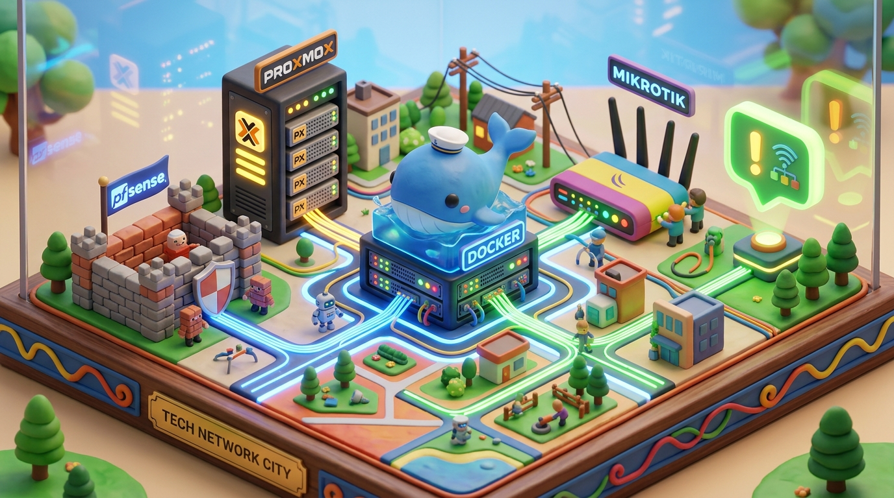
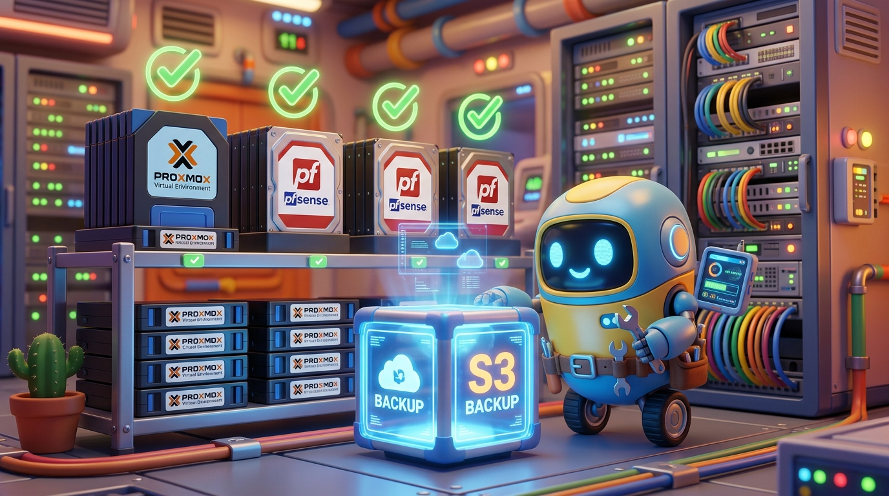

<div align="center">

# 🌐 NOC-Agent
### Engenheiro de Redes & Infraestrutura 24/7 com Inteligência Artificial


[](ROADMAP.md)
[](STACK_SPEC.md)
[](STACK_SPEC.md)
[](STACK_SPEC.md)
[](STACK_SPEC.md)
[](MANUAL_ILUSTRADO.md)
[](ROADMAP.md)

[📘 Manual Ilustrado](MANUAL_ILUSTRADO.md) • [📥 Baixar PDF (5 Páginas)](MANUAL_ILUSTRADO_NOC_AGENT.pdf) • [🏗️ Especificação Técnica](STACK_SPEC.md) • [🚀 Roadmap](ROADMAP.md) • [🛡️ Setup pfSense](PFSENSE-API-SETUP.md)

</div>

---

## 📌 O que significa NOC?

**NOC** é a sigla para **Network Operations Center** (em português, *Centro de Operações de Rede*).

No setor de telecomunicações, provedores de internet (ISPs) e infraestruturas críticas de TI, o NOC é a **torre de controle operacional** que monitora continuamente:
- Se os links de fibra óptica e trânsito IP estão operando ou rompidos;
- Se os firewalls de borda (pfSense) e roteadores (Mikrotik) registram perda de pacotes;
- Se os clusters de virtualização (Proxmox) estão com CPU, memória e discos saudáveis;
- Se os **backups diários** de configurações e máquinas virtuais foram salvos com sucesso no **Storage S3**.

O **NOC-Agent** é um assistente autônomo com IA generativa e chamadas de ferramentas de rede (Tool Calling / MCP) que conecta sua equipe técnica no **WhatsApp (via Chatwoot)** diretamente aos seus equipamentos, respondendo chamados em segundos e agindo preventivamente contra quedas.

---

## 🏗️ Como o Sistema é Construído (Onde Cada Peça Roda)

Toda a solução roda na infraestrutura Docker existente, dividida em dois serviços principais:



```
                            ┌───────────────────────────────────┐
                            │  Operador WhatsApp / Webhook      │
                            │  Chatwoot Inbox (Public API)      │
                            └─────────────────┬─────────────────┘
                                              │
                                              ▼
┌──────────────────────────────────────────────────────────────────────────────────────────────────┐
│                      NOC-AGENT GATEWAY & RUNTIME (Hermes Agent Core)                             │
│                                                                                                  │
│  - Gateway Multicanal (Chatwoot Dual-API Bridge: Account API + Public API)                       │
│  - AI Conversation Engine (Claude 3.5 Sonnet / Haiku / GPT-4o)                                   │
│  - Cofre Criptográfico de Credenciais (Criptografia AES-256-GCM)                                 │
│  - Engine de Aprovação Human-in-the-Loop (Trava em 2 etapas para ações críticas)                  │
│  - Auditoria Proativa de Backups no Storage S3                                                   │
│  - Audit Log Criptográfico Imutável no PostgreSQL                                                │
└───────────────────────────────────────┬──────────────────────────────────────────────────────────┘
                                        │ (Chamadas MCP autenticadas)
                                        ▼
┌──────────────────────────────────────────────────────────────────────────────────────────────────┐
│                             EQUIPAMENTOS DE REDE & DRIVERS                                       │
│                                                                                                  │
│  ┌─────────────────────────┐  ┌─────────────────────────┐  ┌──────────────────────────────────┐  │
│  │   Proxmox VE (REST API) │  │   Mikrotik / pfSense    │  │        Zabbix (REST API)         │  │
│  │   - Status de VMs & CTs │  │   - BGP, Gateways, Pings│  │   - Triggers e Alarmes           │  │
│  │   - Backups vzdump no S3│  │   - Export configs (.rsc│  │   - Histórico de métricas        │  │
│  └─────────────────────────┘  └─────────────────────────┘  └──────────────────────────────────┘  │
└──────────────────────────────────────────────────────────────────────────────────────────────────┘
```

---

## 🚀 Principais Capacidades e Cenários

### 1. 💬 Consulta Rápida via WhatsApp
O técnico manda: *"Como estão os links de internet do pfSense agora?"*  
O agente consulta o endpoint `/api/v2/status/gateways` no firewall e responde em linguagem natural:  
*“GW_VIVO operando normalmente (16ms). Mas o link WANGW caiu com 100% de perda de pacotes!”*

### 2. 🚨 Detecção Noturna e Pré-Diagnóstico Autônomo
Às 03:00 da manhã, ao detectar a queda de um gateway, o agente testa se a interface física subiu, se o IP de teste responde a ping e emite o diagnóstico no grupo de técnicos antes que os clientes percebam.

### 3. 💾 Auditoria e Alerta Proativo de Backups no Storage S3

- Valida se as rotinas de backup do Proxmox, Mikrotik (`.rsc`) e pfSense (`.xml`) foram concluídas com sucesso.
- Checa se o arquivo foi recebido no bucket do **Storage S3** com tamanho válido (> 0 bytes).
- Dispara alerta automático se uma VM ou roteador ficar mais de 24 horas sem um snapshot novo.

### 4. 🛑 Ações Críticas com Aprovação Humana (*Human-in-the-Loop*)

- Comandos de risco (reiniciar VM de banco de dados, reiniciar roteador, derrubar rota estática) **nunca** são executados diretamente.
- O agente gera um código temporário de autorização (ex: `APROVAR 4821`), descreve o impacto técnico e aguarda a confirmação explícita de um operador autorizado.

### 5. 🔐 Cofre Cifrado de Senhas (Padrão AES-256-GCM)

- As credenciais dos roteadores e firewalls **nunca** são armazenadas em texto puro.
- A IA **nunca** lê nem recebe senhas nas respostas.
- A chave mestra descriptografa o token estritamente na memória RAM durante a fração de segundo necessária para disparar a chamada de rede.

### 6. 🏢 Gestão Hierárquica Multi-Tenant (Grupos, Subgrupos e Unidades)
- Suporte a múltiplos clientes/tenants (ex: grupo *SuperTop*) e suas unidades ou lojas (ex: *Loja 01*, *Loja 02*, *CD Distribuição*).
- Cada filial com seu próprio roteador Mikrotik, nó Proxmox VE e máquinas virtuais associadas.
- Visualização em raias dedicadas através do botão **"Agrupar por Unidade"** com contagem instantânea de ativos ativos e degradados por loja.

### 7. 📊 Dashboard Web de Alta Densidade com Telemetria Real
- Cards compactos para monitorar dezenas de nós em uma única tela sem poluição visual.
- Barras de consumo em tempo real para **CPU, RAM e Disco**, além do inventário de VMs e storages do Proxmox.
- **Silenciador de Alertas (Snooze):** Oculta alertas pontuais de redundância/contingência por tempo determinado (15m, 30m, 1h, 4h, 24h) com persistência em `localStorage`.
- **Resiliência Integrada:** Polling automático de telemetria a cada 30 segundos e botão de retry inteligente.

### 8. 🧠 Raciocínio Diagnóstico Autônomo (Hermes AI RAG)
- O Hermes AI Engine analisa a telemetria ao vivo via RAG antes de responder qualquer interação.
- Identificação precisa de entidades no prompt (ex: *"como está a Loja 01 do SuperTop?"*, *"quais VMs estão no Proxmox Calvi?"*).
- Diagnóstico estruturado com 6 padrões operacionais: Visão de Grupo/Tenant, Nó Proxmox, Gateway pfSense, Mikrotik BGP, Auditoria de Backups e Saúde Global.

---

## 📁 Estrutura do Repositório

```
nocagent/
├── .agents/                 # Regras, agentes e habilidades da Antigravity
├── assets/images/           # Ilustrações 3D lúdicas do sistema
├── core/                    # Backend Node.js/Express + Prisma + Hermes AI Engine
│   ├── prisma/              # Schema do banco de dados relacional
│   │   └── schema.prisma    # Modelos: Operator, Equipment, AuditLog, Incident, BackupAudit
│   ├── src/
│   │   ├── agent/           # Hermes AI Runtime, System Prompts e Guardrails
│   │   ├── chatwoot/        # Dual-API Bridge (Account API + Public API)
│   │   ├── mcp/             # Drivers de rede (pfSense, Mikrotik, Proxmox, Zabbix)
│   │   ├── security/        # Cofre AES-256-GCM e controle DCC
│   │   └── server.js        # API REST e Webhook handlers
│   ├── Dockerfile           # Imagem de produção do backend
│   └── package.json
├── web/                     # Frontend Dashboard (React + Vite + Tailwind)
│   ├── src/                 # Componentes, telas de inventário, backups e cofre
│   ├── Dockerfile           # Imagem multi-stage Nginx
│   └── package.json
├── docker-compose.yml       # Orquestração da Stack para Portainer / Traefik
├── .env.example             # Modelo documentado com todas as variáveis
├── MANUAL_ILUSTRADO.md      # Manual completo e didático
├── MANUAL_ILUSTRADO_NOC_AGENT.pdf # PDF de 5 páginas diagramado com arte 3D
├── STACK_SPEC.md            # Especificação técnica dos containers e portas
└── ROADMAP.md               # Fases e cronograma do projeto
```

---

## ⚙️ Variáveis de Ambiente Essenciais (`.env`)

Copie o arquivo de exemplo para configurar o ambiente:

```bash
cp .env.example .env
```

| Grupo | Variáveis Chave | Descrição |
|---|---|---|
| **IA Providers** | `ANTHROPIC_API_KEY`, `OPENAI_API_KEY` | Modelos de raciocínio Claude 3.5 Sonnet / GPT-4o |
| **Banco de Dados** | `DATABASE_URL` | String de conexão PostgreSQL (`postgres:5432/nocagent`) |
| **Fila & Cache** | `REDIS_URL`, `REDIS_KEY_PREFIX` | Redis existente na rede interna (`redis:6379/0`) |
| **Storage S3** | `S3_ENDPOINT`, `S3_BUCKET`, `S3_ACCESS_KEY`, `S3_SECRET_KEY` | Storage S3 para backups, snapshots e relatórios |
| **Chatwoot** | `CHATWOOT_BASE_URL`, `CHATWOOT_ACCOUNT_API_KEY`, `CHATWOOT_INBOX_API_KEY` | Dual-API para mensageria no WhatsApp |
| **Cofre & Segurança** | `VAULT_MASTER_KEY`, `DCC_ENABLED`, `DCC_TOTP_SECRET` | Chave mestra AES-256 e 2FA do superadmin |

---

## 🚀 Como Subir o Projeto

### Modo Docker Compose (Produção / Staging via Portainer)

```bash
# 1. Clone o repositório
git clone https://github.com/Wittemberg/nocagent.git /var/www/nocagent
cd /var/www/nocagent

# 2. Configure as variáveis
cp .env.example .env
nano .env

# 3. Inicie os containers com Traefik na rede interna
docker compose up -d --build
```

O dashboard estará acessível em `https://nocagent.awecloudsolution.com` e a API em `https://nocagent.awecloudsolution.com/api/health`.

---

## 🛡️ As 10 Invariantes Éticas de Infraestrutura

1. **Zero Shell Arbitrário:** A IA nunca tem acesso a terminal `bash/sh` livre. Apenas ferramentas tipadas com validação de esquema (Zod).
2. **Aprovação em 2 Etapas:** Ações de risco (reinicialização de VMs, alteração de rotas) exigem autorização explícita com código efêmero.
3. **Credenciais Cifradas:** Chaves e senhas salvas com AES-256-GCM. A IA nunca recebe tokens em texto puro.
4. **Audit Log Imutável:** Todo comando executado é registrado com operador, data/hora e telemetria.
5. **Backups Obrigatórios:** Verificação de snapshots no Storage S3 antes e depois de janelas de manutenção.
6. **Redundância Respeitada:** Nunca desativar interfaces ou rotas sem confirmar que a contingência está ativa.
7. **Isolamento de Redes:** Tráfego de gerenciamento estritamente confinado à rede Docker interna.
8. **Proteção DCC:** Mudanças estruturais exigem token TOTP de 6 dígitos.
9. **Transparência Técnica:** Todas as mensagens explicam causa provável e evidências numéricas (latência, perda de pacotes).
10. **Princípio do Menor Privilégio:** Usuários comuns operam somente em modo de leitura e diagnóstico (L1).

---

## 📄 Licença

Projeto desenvolvido e mantido por **Wittemberg** / **AWE Cloud Solution**. Todos os direitos reservados.
