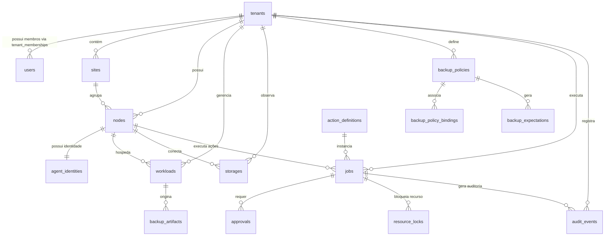

# InfraOps AI — Diagrama Entidade-Relacionamento (ER)

Este documento descreve o modelo relacional de dados PostgreSQL do InfraOps AI, garantindo suporte nativo a multi-tenancy, auditoria encadeada por hash, e controle estrito de ações e jobs.

## Resumo das 19 Tabelas

| Tabela | Finalidade | Chaves / Constraints Principais |
|---|---|---|
| `tenants` | Cadastro de clientes/empresas | `slug` (UNIQUE) |
| `users` | Usuários da plataforma | `email` (UNIQUE) |
| `tenant_memberships` | Associação N:M de usuários e papéis a tenants | UNIQUE(`tenant_id`, `user_id`, `role_id`) |
| `sites` | Locais físicos/lógicos por tenant | `tenant_id`, `code` |
| `nodes` | Hosts físicos/virtuais monitorados | Index: `tenant_id`, `status`, `hostname` |
| `agent_identities` | Credenciais mTLS do Agent Linux por node | `node_id` (UNIQUE), `agent_id` (UNIQUE) |
| `workloads` | VMs, containers e VPS | UNIQUE(`node_id`, `type`, `external_id`) |
| `storages` | Datastores, pools e filesystems observados | `tenant_id`, `node_id`, `external_id` |
| `backup_policies` | Políticas configuradas de backup | `tenant_id`, `schedule_definition` |
| `backup_policy_bindings` | Aplicação de políticas a nodes/workloads | `policy_id`, `tenant_id` |
| `backup_artifacts` | Registro de backups descobertos/executados | `tenant_id`, `node_id`, `integrity_status` |
| `backup_expectations` | Janelas e SLA esperados de backup | `policy_id`, `workload_id`, `window_start` |
| `alerts` | Alertas ativos trazidos de métricas/eventos | Index: (`tenant_id`, `fingerprint`) |
| `incidents` | Incidentes operacionais agrupados | `tenant_id`, `severity`, `opened_at` |
| `action_definitions` | Catálogo de ações registradas e versionadas | UNIQUE(`action_key`, `version`) |
| `jobs` | Execuções de ações solicitadas | UNIQUE(`tenant_id`, `idempotency_key`) |
| `approvals` | Aprovações humanas para jobs de risco | `job_id`, `decided_by_user_id` |
| `resource_locks` | Travas de concorrência para jobs idempotentes | UNIQUE(`resource_type`, `resource_id`, `lock_type`) |
| `audit_events` | Logs imutáveis de auditoria operacional | `previous_hash`, `event_hash` (Hash Chain) |
