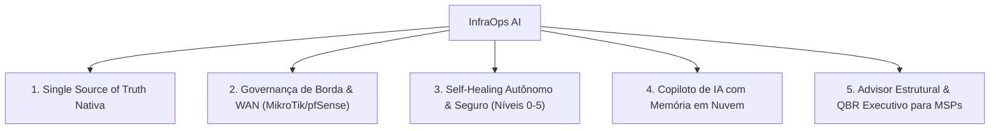

# InfraOps AI — Master Marketing & Sales Playbook

> **Versão:** 2.0 (Produção Homologada — Stages 01 a 27)  
> **Público:** Diretores de TI, CIOs, Gestores de MSPs, Líderes de NOC e Engenheiros de Infraestrutura  
> **Assunto:** Governança Autônoma, Fonte da Verdade Nativa, Observabilidade de Borda (MikroTik/pfSense) e Inteligência de Infraestrutura (AIOps)

---

## 🎯 1. O Que É o InfraOps AI?

O **InfraOps AI** é a primeira plataforma brasileira de **Governança Operacional Autônoma e Inteligência de Infraestrutura (AIOps)** projetada especificamente para MSPs, consultorias de TI e departamentos de tecnologia que administram múltiplos clientes e ambientes heterogêneos.

Ao contrário de ferramentas tradicionais que apenas disparam alertas passivos ou exibem gráficos desconectados (Zabbix, Grafana, NetBox, Nagios), o InfraOps AI unifica em um único painel:
1. **Fonte da Verdade Nativa (Physical & Logical CMDB/IPAM):** Racks 42U, switches, portas, conexões porta-a-porta, VLANs, Subnets e IPAM.
2. **Governança de Roteadores & Links WAN:** Monitoramento em tempo real de equipamentos **MikroTik RouterOS** e **pfSense**, com comutação governada de link primário com Precheck, Snapshot atômico, Postcheck e Rollback automático.
3. **Operações Autônomas & Self-Healing (Níveis 0 a 5):** Resolução automática de incidentes repetitivos (disco cheio, serviços travados, rotas degradadas) sob rígido *Policy Engine* e orçamentos de risco (*Risk Budget*).
4. **Copiloto de IA Contextual Multi-Provedor com Memória em Nuvem:** Diagnósticos em tempo real com memória multi-turn sincronizada entre operadores e dispositivos.
5. **Inteligência Estrutural & Advisor de Negócios:** Mineração de causas-raiz de incidentes repetitivos, projeções de saturação de capacidade (7 a 180 dias), detecção de SPOFs e QBRs executivos automatizados para clientes.

---

## 💎 2. Os 5 Pilares de Valor Comercial

### Pilar 1: Single Source of Truth Nativa (Stage 26)
- **Problema do Cliente:** Informações de infraestrutura espalhadas em planilhas Excel desatualizadas, blocos de notas e ferramentas externas caras e complexas como NetBox ou Device42.
- **Solução InfraOps AI:** Customer Infrastructure Book nativo com elevação visual de Racks 42U, Switch Port Wizard para 24/48 portas, mapa de conexões físicas com cor de cabo, IPAM operacional com detecção de conflitos, fichas com QR Code e checklists de visita técnica presencial com assinatura digital.

### Pilar 2: Governança de Roteadores & Links WAN (Stage 27)
- **Problema do Cliente:** Quedas de Internet que paralisam filiais e lojas físicas porque o failover automático do roteador causa *flapping* (trocas sucessivas) ou porque o operador não tem acesso seguro e comete erros manuais na tabela de rotas.
- **Solução InfraOps AI:** Drivers oficiais para **MikroTik RouterOS** e **pfSense**, telemetria de hardware (CPU/RAM/Temp), monitoramento de latência e perda de pacotes em tempo real, e a ação governada `network.set_primary_wan` com snapshot atômico pré-mudança, postcheck de validação de rota e motor anti-flapping inteligente.

### Pilar 3: Self-Healing Autônomo & Seguro (Stages 21–24)
- **Problema do Cliente:** Técnicos seniores gastam até 60% do tempo apagando incêndios repetitivos de rotina (limpar `/var/log`, reiniciar serviços de banco, desengasgar pools ZFS).
- **Solução InfraOps AI:** O sistema detecta o incidente, avalia evidências, executa prechecks, aplica a Action homologada e valida o postcheck. Nenhuma linha de terminal livre é permitida (`INICIATIVA ≠ PRIVILÉGIO`), garantindo 100% de segurança contra acidentes operacionais.

### Pilar 4: Copiloto de IA Multi-Provedor com Memória em Nuvem
- **Problema do Cliente:** IAs genéricas não conhecem a topologia real do ambiente e perdem o histórico da conversa ao trocar de tela ou máquina.
- **Solução InfraOps AI:** O assistente recebe o contexto ao vivo dos nós Proxmox, VMs, storages, ativos físicos e links WAN. O histórico conversacional é sincronizado no backend, permitindo que a equipe colabore de qualquer lugar sem perda de contexto.

### Pilar 5: Advisor Estrutural & QBR Executivo para MSPs (Stage 25)
- **Problema do Cliente:** Dificuldade de demonstrar o valor técnico entregue ao cliente final e justificar novos investimentos em hardware e projetos.
- **Solução InfraOps AI:** Relatórios executivos mensais com cálculo transparente de horas economizadas, incidentes prevenidos, Score de Dívida Técnica (0–100) e projeções de capacidade baseadas em telemetria real.

---

## 💬 3. Matriz de Argumentação e Tratamento de Objeções

| Objeção Comum | Resposta Comercial & Técnica Estruturada |
|---|---|
| *"Já usamos Zabbix e Grafana. Por que precisamos do InfraOps AI?"* | O Zabbix apenas avisa que o servidor caiu. O InfraOps AI entende a causa, possui o inventário físico da porta do switch e do link de internet, resolve o incidente sozinho via Self-Healing governado e impede que ele volte a acontecer orientando a melhoria estrutural. |
| *"A IA pode rodar comandos perigosos e quebrar o ambiente?"* | **Não.** O sistema proíbe categoricamente `shell.exec` ou scripts livres. Toda operação é uma Action registrada, com precheck, snapshot atômico e rollback automático garantido por drivers especializados. |
| *"Já temos NetBox para documentar a rede."* | O InfraOps AI elimina a necessidade de manter e pagar ferramentas externas de CMDB. Ele une a documentação física (racks, cabos, IPAM) com a telemetria ao vivo e o motor de automação. |
| *"Como o InfraOps AI me ajuda a vender mais serviços de TI?"* | Com os Relatórios Executivos (QBR) e a Projeção Preditiva de Capacidade, você apresenta ao cliente dados matemáticos comprovando quando o storage vai lotar e quais servidores precisam de upgrade antes que ocorra uma parada. |

---

## 📢 4. Copywriting & Frases de Alto Impacto

- **Headlines Principais:**
  - *Infraestrutura sob controle. Inteligência para agir.*
  - *Da porta do switch ao link de internet: governança total em um único painel.*
  - *Pare de resolver o mesmo incidente toda semana. Elimine a causa-raiz.*
  - *Do firefighting operacional à governança autônoma e previsível.*
- **Chamadas para Ação (CTAs):**
  - *"Agende uma demonstração ao vivo no seu cluster Proxmox ou roteador MikroTik."*
  - *"Descubra a Dívida Técnica da sua infraestrutura em menos de 15 minutos."*
