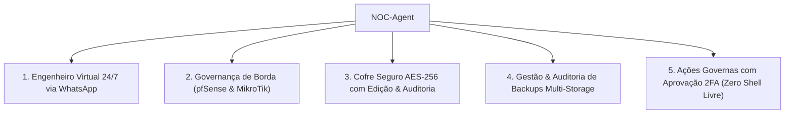

# 📢 Playbook Master de Marketing & Vendas — NOC-Agent
> **Versão:** 2.0 (Produção Homologada — Herança & Evolução do InfraOps AI)  
> **Público-Alvo:** Provedores de Internet (ISPs), Diretores de TI, CIOs, Gestores de MSPs, Líderes de NOC e Engenheiros de Redes  
> **Proposta Central:** Engenharia Autônoma de Operações de Rede 24/7 com IA Contextual, Chatwoot WhatsApp Dual-API, Cofre AES-256 e Governança Ativa de Borda (pfSense, MikroTik, Proxmox e Storages).

---

## 🎯 1. O que é o NOC-Agent?

O **NOC-Agent** é a primeira plataforma brasileira de **Operações de Rede Autônomas e Inteligência de Infraestrutura (AIOps)** orientada a mensageria instantânea (WhatsApp via Chatwoot) e painel web operacional.

Diferente de monitoramentos passivos que apenas disparam alarmes para o operador acordar de madrugada (como Zabbix, Grafana ou Nagios), o NOC-Agent:
1. **Atua como um Engenheiro N1/N2 Autônomo 24/7:** Interpreta solicitações em linguagem natural pelo WhatsApp ou Web, executa diagnósticos reais e efetua ações com governança estrita e aprovação humana de dois fatores (DCC/TOTP).
2. **Cofre Criptográfico de Equipamentos (AES-256-GCM):** Centraliza tokens de API e credenciais de switches, roteadores e servidores com criptografia de ponta e isolamento absoluto de memória.
3. **Governança de Borda & WAN:** Coleta telemetria em tempo real de equipamentos **pfSense** e **MikroTik RouterOS** (latência RTT, perda de pacotes, status de gateways, failover seguro e anti-flapping).
4. **Auditoria & Execução Ativa de Backups Multi-Storage:** Não se limita a um bucket estático. Permite cadastrar múltiplos storages (MinIO local, S3, Wasabi, SFTP, NFS) e disparar backups dos ativos de rede com retenção e versionamento.
5. **Zero Dados Fictícios (Integridade Operacional Absoluta):** Todas as telas, métricas e alertas refletem exclusivamente o estado real dos equipamentos consultados via API.

---

## 💎 2. Os 5 Pilares de Valor Comercial

### Pilar 1: Engenheiro Virtual 24/7 via WhatsApp (Chatwoot Dual-API)
- **Problema do Cliente:** Manter equipe de plantão de NOC 24x7 é extremamente caro, sujeito a turnover e com tempo de resposta lento na madrugada.
- **Solução NOC-Agent:** O Hermes Agent atende no WhatsApp do suporte em segundos, identifica o operador autenticado, responde sobre a saúde dos links de internet e executa rotinas homologadas.

### Pilar 2: Governança de Borda & WAN em Tempo Real
- **Problema do Cliente:** Quedas de link de internet que paralisam filiais e lojas físicas sem que o operador saiba qual rota caiu ou se há degradação de pacotes.
- **Solução NOC-Agent:** Consulta direta às APIs de pfSense e MikroTik, medição de latência RTT milissegundo a milissegundo, alarme específico para link degradado e mitigação rápida.

### Pilar 3: Cofre Criptográfico com Edição Completa & Auditoria Imutável
- **Problema do Cliente:** Senhas de roteadores e chaves de API salvas em planilhas ou arquivos de texto vulneráveis a vazamentos.
- **Solução NOC-Agent:** Todas as credenciais cifradas com AES-256-GCM no PostgreSQL. Interface completa para **Cadastrar, Editar Parâmetros, Renovar Chaves e Auditar** quem acessou cada ativo.

### Pilar 4: Backups Multi-Storage (MinIO, S3, Wasabi, SFTP)
- **Problema do Cliente:** Backups de roteadores não são feitos com frequência ou ficam concentrados em um único local desprotegido.
- **Solução NOC-Agent:** Permite definir onde cada equipamento salvará sua cópia (storage local para recuperação rápida + offsite para Disaster Recovery).

### Pilar 5: Segurança Operacional & 2FA (INICIATIVA ≠ PRIVILÉGIO)
- **Problema do Cliente:** Medo de que uma IA ou um operador execute comandos perigosos de terminal e derrube a rede da empresa.
- **Solução NOC-Agent:** Nenhuma linha de terminal livre (`arbitrary shell`) é permitida. Ações críticas (como reiniciar VM, comutar link primário) exigem código temporário de aprovação (TOTP) de um administrador humano.

---

## 💬 3. Matriz de Argumentação e Tratamento de Objeções

| Objeção Comum | Resposta Comercial & Técnica Estruturada |
|---|---|
| *"Já usamos Zabbix e Grafana. Por que precisamos do NOC-Agent?"* | O Zabbix apenas envia uma notificação passiva de que algo caiu. O NOC-Agent conversa com o operador no WhatsApp, investiga a causa, checa a latência e perda de pacotes dos gateways, executa ações corretivas autorizadas e valida se o serviço voltou ao normal. |
| *"A IA tem acesso para rodar comandos livres e perigosos no meu firewall?"* | **Não.** O NOC-Agent opera sob a regra de Governança Estrita. Ele não tem acesso a shell livre (`bash`/`sh`). Todas as operações são chamadas estritas de API ou rotinas pré-homologadas, e mudanças de impacto exigem código de confirmação 2FA. |
| *"Nossos clientes usam tanto MikroTik quanto pfSense. A ferramenta atende ambos?"* | **Sim.** O NOC-Agent possui drivers específicos para **MikroTik RouterOS** (REST/API) e **pfSense** (REST API v2), suportando monitoramento de gateways, interfaces e extração de configurações. |
| *"Como o NOC-Agent reduz meus custos operacionais?"* | Ele absorve até 70% das tarefas repetitivas de N1/N2 (checagem de status de internet, consulta de backups, reinicialização controlada de serviços), liberando seus engenheiros seniores para projetos de maior valor e permitindo operar 24/7 sem aumentar o quadro de pessoal. |

---

## 📢 4. Copywriting & Frases de Alto Impacto para Vendas

- **Headlines:**
  - *Seu NOC em operação 24 horas por dia, direto no WhatsApp da sua equipe.*
  - *Da telemetria do pfSense ao backup no storage: inteligência e governança em tempo real.*
  - *Pare de acordar de madrugada para diagnosticar quedas de link. Deixe a IA operar com você.*
  - *Menos firefighting, mais previsibilidade para sua infraestrutura de TI.*
- **Chamadas para Ação (CTAs):**
  - *"Conecte seu primeiro pfSense ou MikroTik no Cofre e veja o diagnóstico em tempo real em menos de 5 minutos."*
  - *"Agende uma sessão técnica e veja o NOC-Agent diagnosticando incidentes reais no WhatsApp."*

---

## 💼 5. Modelos de Oferta para MSPs & Provedores

1. **Plano Starter (Pequenas Empresas & Filiais):**
   - Até 5 equipamentos gerenciados (Firewalls/Roteadores).
   - Atendimento via WhatsApp para até 3 operadores.
   - Auditoria diária de backups.
2. **Plano Professional (MSPs & Médias Empresas):**
   - Até 25 equipamentos gerenciados (MikroTik, pfSense, nós Proxmox).
   - Múltiplos storages de destino (MinIO + Cloud S3/Wasabi).
   - Operadores ilimitados no Chatwoot com níveis L1, L2 e L3.
3. **Plano Enterprise (Grandes Redes & Provedores):**
   - Equipamentos ilimitados com alta disponibilidade.
   - Governança multi-tenant com relatórios executivos mensais de SLA.
   - Rotinas customizadas de self-healing e automação sob medida.
